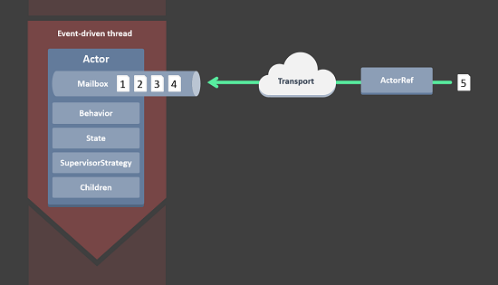
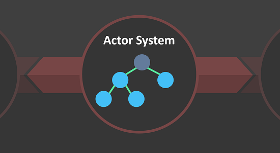
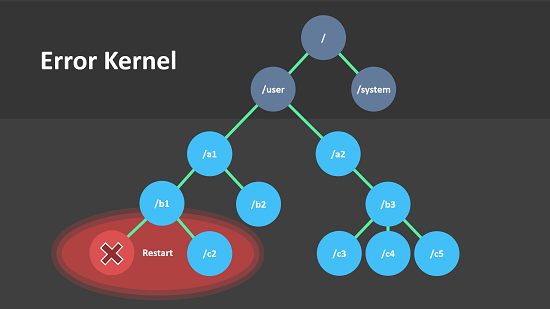

# CSharp Library

## Akka.NET

> [http://akkadotnet.github.io/](http://akkadotnet.github.io/)

	LICENSE: Apache V2.0

**Akka.NET** is a port of the popular Java/Scala framework Akka to .NET. This is a community driven port and is not affiliated with Typesafe who makes the original Java/Scala version.

#### **Actor** Model

The Actor Model provides a higher level of abstraction for writing concurrent and distributed systems. It alleviates the developer from having to deal with explicit locking and thread management, making it easier to write correct concurrent and parallel systems.

#### **Distributed** by Default

Everything in Akka.NET is designed to work in a distributed setting: all interactions of actors use purely message passing and everything is asynchronous. This effort has been undertaken to ensure that all functions are available equally when running within a single process or on a cluster of hundreds of machines. The key for enabling this is to go from remote to local by way of optimization instead of trying to go from local to remote by way of generalization. See this classic paper for a detailed discussion on why the second approach is bound to fail.

#### **Supervision** & monitoring

Actors form a tree with actors being parents to the actors they've created. As a parent, the actor is responsible for handling its children’s failures (so-called supervision), forming a chain of responsibility, all the way to the top. When an actor crashes, its parent can either restart or stop it, or escalate the failure up the hierarchy of actors. This enables a clean set of semantics for managing failures in a concurrent, distributed system and allows for writing highly fault-tolerant systems that self-heal.

## math.net numerics

> [http://numerics.mathdotnet.com/](http://numerics.mathdotnet.com/)

	LICENSE: MIT/X11

**Math.NET** Numerics aims to provide methods and algorithms for numerical computations in science, engineering and every day use. Covered topics include special functions, linear algebra, probability models, random numbers, interpolation, integration, regression, optimization problems and more.

**Math.NET Numerics** is part of the Math.NET initiative and is the result of merging dnAnalytics with Math.NET Iridium, replacing both. It targets Microsoft .Net 4, .Net 3.5 and Mono (Windows, Linux and Mac), Silverlight 5, WindowsPhone 8, Windows 8/Store (PCL 47, 136) and Android/iOS (Xamarin). In addition to a purely managed implementation it also supports native hardware optimization. Available for free under the MIT/X11 License.

