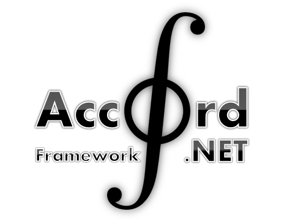
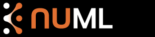

## Machine Leaning

### Accord.NET Framework

> [http://accord-framework.net/](http://accord-framework.net/)

	LICENSE: LGPL

The **Accord.NET Framework** is a complete framework for building machine learning, computer vision, computer audition, signal processing and statistical applications. Sample applications provide a fast start to get up and running quickly, and an extensive documentation helps fill in the details.

### Encog

> [http://www.heatonresearch.com/encog](http://www.heatonresearch.com/encog)

	LICENSE: Apache v2.0

**Encog** is an advanced machine learning framework that supports a variety of advanced algorithms, as well as support classes to normalize and process data. Machine learning algorithms such as Support Vector Machines, Artificial Neural Networks, Genetic Programming, Bayesian Networks, Hidden Markov Models and Genetic Algorithms are supported. Most Encog training algoritms are multi-threaded and scale well to multicore hardware. A GUI based workbench is also provided to help model and train machine learning algorithms. Encog has been in active development since 2008.

### nuML

> [http://numl.net/](http://numl.net/)

	LICENSE: GPLv2

This library is designed to assist in the use of common Machine Learning Algorithms in conjunction with the .NET platform. It is designed to include the most popular supervised and unsupervised learning algorithms while minimizing the friction involved with creating the predictive models.