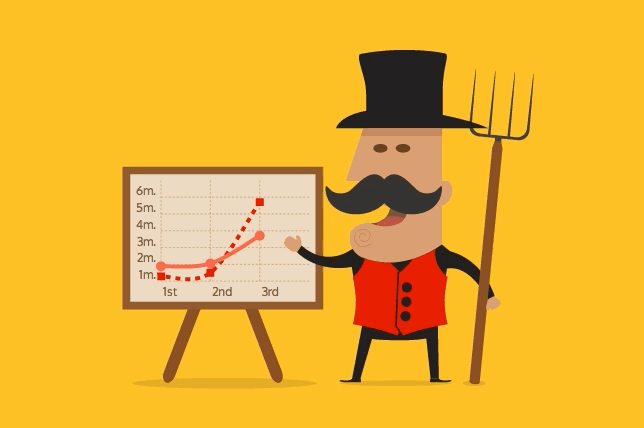
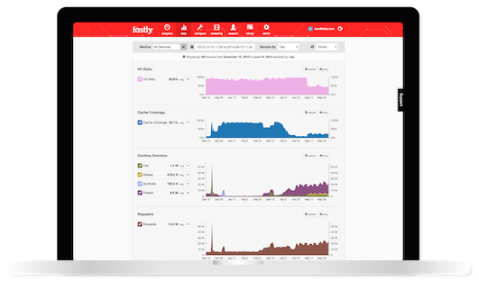
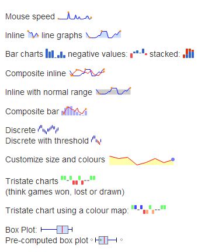

# Chart

## chart.js

> [http://www.chartjs.org/](http://www.chartjs.org/)

	LICENSE: MIT

Simple HTML5 Charts using the canvas element chartjs.org.

## Chartist.js

> [http://gionkunz.github.io/chartist-js](http://gionkunz.github.io/chartist-js)

	LICENSE: 


**Chartist.js** is a simple responsive charting library built with SVG. There are hundreds of nice charting libraries already out there, but they are either:

- not responsive
- use the wrong technologies for illustration (canvas)
- are not flexible enough while keeping the configuration simple
- are not friendly to your own code
- are not friendly to designers
- have unnecessary dependencies to monolithic libraries
- more annoying things

That's why we have started Chartist.js and our goal is to solve all of the above issues.

#### What is it made for?

Chartist's goal is to provide a simple, lightweight and non-intrusive library to responsive craft charts on your website. It's important to understand that one of the main intentions of Chartist.js is to rely on standards rather than providing a own solution to the problem which is is already solved by the standard. We need to leverage the power of the browsers today and say good bye to the idea of solving all problems ourselves.

Chartist works with inline-SVG and therefore leverages the power of the DOM to provide parts of its functionality. This also means that Chartist is not providing it's own event handling, labels, behaviors and anything else that can just be done with plain HTML, JavaScript and CSS. The single and only responsibility of Chartist is to help you drawing "Simple responsive Charts" using inline-SVG in the DOM, CSS to style and JavaScript to provide an API for configuring your charts.

## Cubism.js

> [http://square.github.io/cubism/](http://square.github.io/cubism/)

	LICENSE: Apache v2.0

**Cubism.js** is a D3 plugin for visualizing time series. Use Cubism to construct better realtime dashboards, pulling data from Graphite, Cube and other sources. Cubism is available under the Apache License on GitHub.

#### Demos


## dc.js

> [http://dc-js.github.io/dc.js/](http://dc-js.github.io/dc.js/)

	LICENSE: Apache v2.0


**dc.js** is a javascript charting library with native crossfilter support and allowing highly efficient exploration on large multi-dimensional dataset (inspired by crossfilter's demo). It leverages d3 engine to render charts in css friendly svg format. Charts rendered using dc.js are naturally data driven and reactive therefore providing instant feedback on user's interaction. The main objective of this project is to provide an easy yet powerful javascript library which can be utilized to perform data visualization and analysis in browser as well as on mobile device.

## dimple

> [http://dimplejs.org/](http://dimplejs.org/)

	LICENSE: MIT
	
**Dimple** is an object-oriented API allowing you to create flexible axis-based charts using d3.js.

The intention of this project is to allow analysts who are not necessarily expert JavaScript programmers to create standard (and some not-so-standard) business analytics.

The API will also expose the core d3 objects where possible so that as users gain confidence they can extend the base functionality in whatever way they wish.


## dygraphs

> [http://dygraphs.com](http://dygraphs.com/)
	
	LICENSE: MIT

**dygraphs** is a fast, flexible open source JavaScript charting library.It allows users to explore and interpret dense data sets. 

#### Features
- Handles huge data sets: dygraphs plots millions of points without getting bogged down.
- Interactive out of the box: zoom, pan and mouseover are on by default.
- Strong support for error bars / confidence intervals.
- Highly customizable: using options and custom callbacks, you can make dygraphs do almost anything.
- dygraphs is highly compatible: it works in all major browsers (including IE8). You can even pinch to zoom on mobile/tablet devices!
- There's an active community developing and supporting dygraphs.

#### Examples:

```javascript
new Dygraph(div, "ny-vs-sf.txt", {
  legend: 'always',
  title: 'NYC vs. SF',
  showRoller: true,
  rollPeriod: 14,
  customBars: true,
  ylabel: 'Temperature (F)',
});
```


## ECharts

> [http://echarts.baidu.com](http://echarts.baidu.com/)
	
	LICENSE: 
	BROWSER: IE6/7/8/9+，chrome、firefox、safari、opera 


基于Canvas，纯Javascript图表库，提供直观，生动，可交互，可个性化定制的数据可视化图表。创新的拖拽重计算、数据视图、值域漫游等特性大大增强了用户体验，赋予了用户对数据进行挖掘、整合的能力。

## Epoch

> [http://fastly.github.io/epoch/](http://fastly.github.io/epoch/)

	LICENSE: MIT

**Epoch** is a general purpose charting library for application developers and visualization designers. It focuses on two different aspects of visualization programming: basic charts for creating historical reports, and real-time charts for displaying frequently updating timeseries data.



## Flot

> [http://www.flotcharts.org](http://www.flotcharts.org/)

	LICENSE: BSD New
	BROWSER: Internet Explorer 6+, Chrome, Firefox 2+, Safari 3+ and Opera 9.5+


**Flot** is a pure JavaScript plotting library for jQuery, with a focus on simple usage, attractive looks and interactive features.

## MetricsGraphics.js

> [http://metricsgraphicsjs.org/](http://metricsgraphicsjs.org/)

	LICENSE: MPL v2.0


**MetricsGraphics.js** is a library optimized for visualizing and laying out time-series data. At under 50KB (minified), it provides a simple way to produce common types of graphics in a principled, consistent and responsive way. The library currently supports line charts, scatterplots and histograms as well as features like rug plots and basic linear regression.

## NVD3

> [http://nvd3.org/index.html](http://nvd3.org/index.html)

	LICENSE: Apache v2.0
	BROWSER: Chrome, Opera 15+, Safari, Firefox, IE 10+
	
**NVD3** is an attempt to build re-usable charts and chart components for d3.js without taking away the power that d3.js gives you. This is a very young collection of components, with the goal of keeping these components very customizeable, staying away from your standard cookie cutter solutions.

## Highcharts

> [http://www.highcharts.com/](http://www.highcharts.com/)

	LICENSE: FREE FOR NON-COMMERCIAL

**Highcharts** is a JavaScript charting library with a huge range of chart options available. The output is rendered using SVG in modern browsers and VML in Internet Explorer. The charts are beautifully animated into view automatically, and the framework also supports live data streams. It's free to download and use non-commercially (and licensable for commercial use). You can also play with the extensive demos using JSFiddle.

## jsPlumb

> [https://jsplumbtoolkit.com](https://jsplumbtoolkit.com)

	LICENSE: MIT and GPLv2
	TAG: SVG, Canvas

**jsPlumb** provides a means for a developer to visually connect elements on their web pages. It uses SVG or Canvas in modern browsers, and VML on IE 8 and below. The latest version is 1.7.3; this will be the final version (apart from bugfix releases in 1.7.x) to support IE8. The next major release will be 2.0.0, and this will work only in modern browsers that support SVG.


## Sparklines

> [http://omnipotent.net/jquery.sparkline/#s-about](http://omnipotent.net/jquery.sparkline/#s-about")

	LICENSE: BSD New
	BROWSER: Firefox 2+, Safari 3+, Opera 9 and Internet Explorer 6, 7 & 8

jQuery **Sparklines** is a jQuery plugin that generates sparklines (small inline charts) directly in the browser using data supplied either inline in the HTML, or via javascript.

#### Demos:


## tangle

> [http://worrydream.com/Tangle/](http://worrydream.com/Tangle/)

	LICENSE: 

Tangle is a JavaScript library for creating reactive documents. Your readers can interactively explore possibilities, play with parameters, and see the document update immediately. Tangle is super-simple and easy to learn.