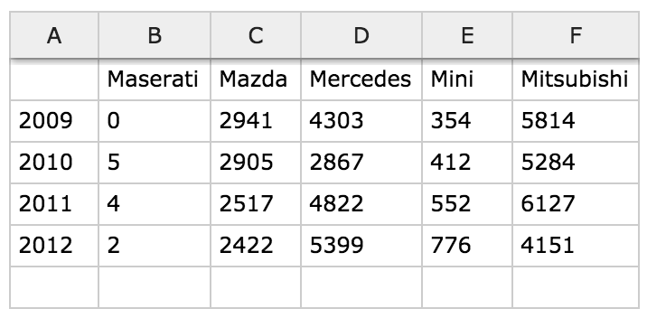
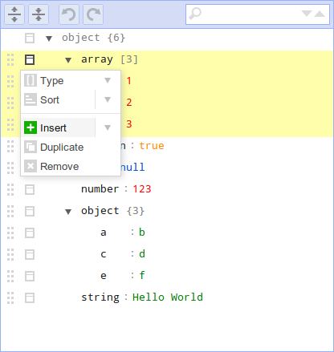
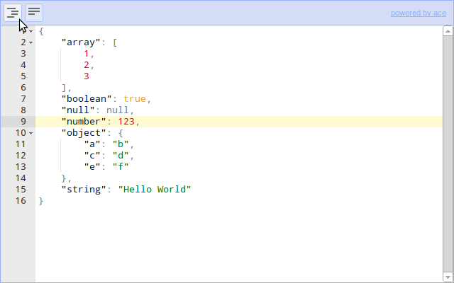
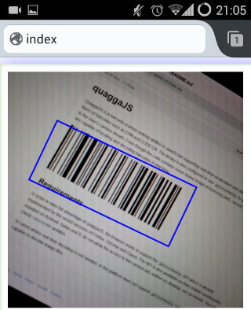
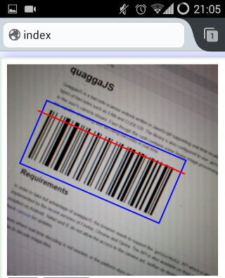

# Components

## AnimateScroll

> [http://plugins.compzets.com/animatescroll/](http://plugins.compzets.com/animatescroll/)

	LICENSE: MIT

**AnimateScroll** is a jQuery plugin which enables you to scroll to any part of the page in style by just calling the animatescroll() function with the Id or Classname of the element where you want to scroll to.

## CodeMirror

> [http://codemirror.net/](http://codemirror.net/)

	LICENSE: MIT
	BROWSER: Firefox 4+, Chrome, Safari 5.2+, Internet Explorer 8+, Opera 9+

**CodeMirror** is a versatile text editor implemented in JavaScript for the browser. It is specialized for editing code, and comes with a number of language modes and addons that implement more advanced editing functionality.
A rich programming API and a CSS theming system are available for customizing CodeMirror to fit your application, and extending it with new functionality.

#### Features

- Support for over 60 languages out of the box
- A powerful, composable language mode system
- Autocompletion (XML)
- Code folding
- Configurable keybindings
- Vim, Emacs, and Sublime Text bindings
- Search and replace interface
- Bracket and tag matching
- Support for split views
- Linter integration
- Mixing font sizes and styles
- Various themes
- Able to resize to fit content
- Inline and block widgets
- Programmable gutters
- Making ranges of text styled, read-only, or atomic
- Bi-directional text support
- Many other methods and addons...

## Dropdown Check List

> [http://www.gcooler.com/uploadfile/favorites/demo/dropdown-check-list.0.9/demo.html](http://www.gcooler.com/uploadfile/favorites/demo/dropdown-check-list.0.9/demo.html)

	LICENSE: MIT
	BROWSER: Internet Explorer 6+, Chrome, Firefox 2+, Safari 3+ and Opera 9.5+

The **Dropdown Check List** jQuery widget transforms a regular select html element into a dropdown checkbox list. The plugin is hosted on google code.

#### Demos:

## FitText.js

> [http://fittextjs.com/](http://fittextjs.com/)

	LICENSE:

**FitText** makes font-sizes flexible. Use this plugin on your fluid or responsive layout to achieve scalable headlines that fill the width of a parent element.

## Flickity

> [http://flickity.metafizzy.co/](http://flickity.metafizzy.co/)

	LICENSE: GPL v3

Touch, responsive, flickable galleries.

## Freewall

> [https://github.com/kombai/freewall](https://github.com/kombai/freewall)

	LICENSE: MIT
	BROWSER: Chrome, Opera, Safari, IE 8.0+, Firefox

**Freewall** is a cross-browser and responsive jQuery plugin to help you create many types of grid layouts: flexible layouts, images layouts, nested grid layouts, metro style layouts, pinterest like layouts ... with nice CSS3 animation effects and call back events. Freewall is all-in-one solution for creating dynamic grid layouts for desktop, mobile, and tablet...

#### Features

- Draggable support
- Direction support
- Custom Plugin
- Responsive grid
- Gaps control
- Filter items
- CSS3 animation (js fallback)
- Nested grid
- Images grid/layout
- Fit container
- Vertical grid/layout
- Horizontal grid/layout
- Window 8 metro style
- Pinterest like grid/layout

#### Demo

## Handsontable

[http://handsontable.com/index.html](http://handsontable.com/index.html)

	LICENSE: MIT
	BROWSER: IE 10+, Firefox, Chrome, Safari and Opera.

**Handsontable** is a minimalist approach to Excel-like table editor (datagrid/data grid) in HTML & JavaScript.

#### Demo

## jsoneditor

[https://github.com/josdejong/jsoneditor](https://github.com/josdejong/jsoneditor)

	LICENSE: Apache v2.0
	BROWSER: Chrome, Firefox, Safari, Opera, Internet Explorer 9+

**JSON Editor** is a web-based tool to view, edit, and format JSON. It has various modes such as a tree editor, a code editor, and a plain text editor.

The editor can be used as a component in your own web application. The library can be loaded as CommonJS module, AMD module, or as a regular javascript file.

#### Features

#### Tree editor

- Edit, add, move, remove, and duplicate fields and values.
- Change type of values.
- Sort arrays and objects.
- Colorized code.
- Search & highlight text in the treeview.
- Undo and redo all actions.

#### Code editor

- Format and compact JSON.
- Colorized code (powered by Ace).
- Inspect JSON (powered by Ace).

#### Text editor

- Format and compact JSON.

#### Demo

## nanobar.js

> [http://nanobar.micronube.com/](http://nanobar.micronube.com/)

	LICENSE: MIT

Very lightweight progress bars (~630 bytes gzipped). No jQuery needed.

## Isotope

> [http://isotope.metafizzy.co/layout-modes.html](http://isotope.metafizzy.co/layout-modes.html)

	LICENSE: GPL v3

Filter & sort magical layouts.

#### Demo

## QuaggaJS

> [https://github.com/serratus/quaggaJS](https://github.com/serratus/quaggaJS)

	LICENSE: 

**QuaggaJS** is a barcode-scanner entirely written in JavaScript supporting real-time localization and decoding of various types of barcodes such as EAN and CODE128. The library is also capable of using getUserMedia to get direct access to the user's camera stream. Although the code relies on heavy image-processing even recent smartphones are capable of locating and decoding barcodes in real-time. Try some [examples](http://serratus.github.io/quaggaJS/examples) and check out the blog post  if you want to dive deeper into this topic.

## rome

> [http://bevacqua.github.io/rome/](http://bevacqua.github.io/rome/)

	LICENSE: MIT

Customizable date (and time) picker. Opt-in UI, no jQuery!

#### Demo

## Semantic-UI

[http://semantic-ui.com/](http://semantic-ui.com/)

	LICENSE: MIT

**Semantic** is a highly-themable UI framework with naming conventions built around common usage.

#### Key Features

 - 50+ UI Elements
 - 3000 + CSS Variables
 - 3 Levels of Variable Inheritance (Similar to SublimeText)
 - Built using EM values for responsive design

#### Browser Support

 - Last 2 Versions FF, Chrome, IE (aka 10+)
 - Safari 6
 - IE 9+ (Browser prefix only)
 - Android 4
 - Blackberry 10

## snap.js

> [https://github.com/jakiestfu/Snap.js](https://github.com/jakiestfu/Snap.js)

	LICENSE: MIT

A Library for creating beautiful mobile shelfs in Javascript (Facebook and Path style side menus)

#### Demo

## Sortable

> [http://rubaxa.github.io/Sortable/](http://rubaxa.github.io/Sortable/)

	LICENSE: MIT

**Sortable** — is a minimalist JavaScript library for reorderable drag-and-drop lists on modern browsers and touch devices. No jQuery. Supports Meteor, AngularJS, React and any CSS library, e.g. Bootstrap.

#### Features

* Supports touch devices and modern browsers
* Can drag from one list to another or within the same list
* CSS animation when moving items
* Supports drag handles and selectable text (better than voidberg's html5sortable)
* Smart auto-scrolling
* Built using native HTML5 drag and drop API
* Supports Meteor and AngularJS
* Supports any CSS library, e.g. Bootstrap
* Simple API
* No jQuery

## stacky

> [https://github.com/niki4810/stacky](https://github.com/niki4810/stacky)

	LICENSE: MIT

A simple jquery plugin for organizing your container as a stack.

#### Demo

## TimelineJS

> [http://timeline.knightlab.com/](http://timeline.knightlab.com/)

	LICENSE: MPL v2.0

**TimelineJS** is an open-source tool that enables you to build visually-rich interactive timelines and is available in 40 languages.

## tyto

> [http://jh3y.github.io/tyto/](http://jh3y.github.io/tyto/)

	LICENSE: MIT

**tyto** is a completely configurable, extensible and customizable management and organisation tool (wow that's a mouthful!)

#### Features

- nice simple user interface for managing and organising
- no accounts necessary
- easy to use
- easy to configure
- easy to extend and develop
- localStorage persistence
- sortable columns and items

#### Demo

