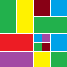

# Components

## AnimateScroll

> [http://plugins.compzets.com/animatescroll/](http://plugins.compzets.com/animatescroll/)

	LICENSE: MIT

**AnimateScroll** is a jQuery plugin which enables you to scroll to any part of the page in style by just calling the animatescroll() function with the Id or Classname of the element where you want to scroll to.

## Dropdown Check List

> [http://www.gcooler.com/uploadfile/favorites/demo/dropdown-check-list.0.9/demo.html](http://www.gcooler.com/uploadfile/favorites/demo/dropdown-check-list.0.9/demo.html)

	LICENSE: MIT
	BROWSER: Internet Explorer 6+, Chrome, Firefox 2+, Safari 3+ and Opera 9.5+

The **Dropdown Check List** jQuery widget transforms a regular select html element into a dropdown checkbox list. The plugin is hosted on google code.

#### Demos:

## FitText.js

> [http://fittextjs.com/](http://fittextjs.com/)

	LICENSE:

**FitText** makes font-sizes flexible. Use this plugin on your fluid or responsive layout to achieve scalable headlines that fill the width of a parent element.

## Freewall

[https://github.com/kombai/freewall](https://github.com/kombai/freewall)

	LICENSE: MIT
	BROWSER: Chrome, Opera, Safari, IE 8.0+, Firefox

**Freewall** is a cross-browser and responsive jQuery plugin to help you create many types of grid layouts: flexible layouts, images layouts, nested grid layouts, metro style layouts, pinterest like layouts ... with nice CSS3 animation effects and call back events. Freewall is all-in-one solution for creating dynamic grid layouts for desktop, mobile, and tablet...

#### Features

- Draggable support
- Direction support
- Custom Plugin
- Responsive grid
- Gaps control
- Filter items
- CSS3 animation (js fallback)
- Nested grid
- Images grid/layout
- Fit container
- Vertical grid/layout
- Horizontal grid/layout
- Window 8 metro style
- Pinterest like grid/layout

#### Demo

## nanobar.js

> [http://nanobar.micronube.com/](http://nanobar.micronube.com/)

	LICENSE: MIT

Very lightweight progress bars (~630 bytes gzipped). No jQuery needed.

## Isotope

> [http://isotope.metafizzy.co/layout-modes.html](http://isotope.metafizzy.co/layout-modes.html)

	LICENSE: GPL v3

Filter & sort magical layouts.

#### Demo

## rome

> [http://bevacqua.github.io/rome/](http://bevacqua.github.io/rome/)

	LICENSE: MIT

Customizable date (and time) picker. Opt-in UI, no jQuery!

#### Demo

## snap.js

> [https://github.com/jakiestfu/Snap.js](https://github.com/jakiestfu/Snap.js)

	LICENSE: MIT

A Library for creating beautiful mobile shelfs in Javascript (Facebook and Path style side menus)

#### Demo

## stacky

> [https://github.com/niki4810/stacky](https://github.com/niki4810/stacky)

	LICENSE: MIT

A simple jquery plugin for organizing your container as a stack.

#### Demo

## tyto

> [http://jh3y.github.io/tyto/](http://jh3y.github.io/tyto/)

	LICENSE: MIT

**tyto** is a completely configurable, extensible and customizable management and organisation tool (wow that's a mouthful!)

#### Features

- nice simple user interface for managing and organising
- no accounts necessary
- easy to use
- easy to configure
- easy to extend and develop
- localStorage persistence
- sortable columns and items

#### Demo

