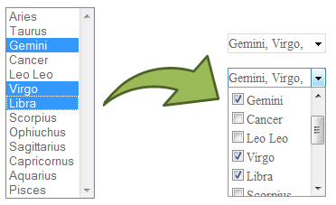

jQuery Plugin
=============

Dropdown Check List
-------------------

> [http://www.gcooler.com/uploadfile/favorites/demo/dropdown-check-list.0.9/demo.html](http://www.gcooler.com/uploadfile/favorites/demo/dropdown-check-list.0.9/demo.html)

	LICENSE: MIT
	BROWSER: Internet Explorer 6+, Chrome, Firefox 2+, Safari 3+ and Opera 9.5+

The **Dropdown Check List** jQuery widget transforms a regular select html element into a dropdown checkbox list. The plugin is hosted on google code.

#### Demos:

Flot
----

> [http://www.flotcharts.org](http://www.flotcharts.org/)

	LICENSE: BSD New
	BROWSER: Internet Explorer 6+, Chrome, Firefox 2+, Safari 3+ and Opera 9.5+

**Flot** is a pure JavaScript plotting library for jQuery, with a focus on simple usage, attractive looks and interactive features.

Sparklines
----------

> [http://omnipotent.net/jquery.sparkline/#s-about](http://omnipotent.net/jquery.sparkline/#s-about")

	LICENSE: BSD New
	BROWSER: Firefox 2+, Safari 3+, Opera 9 and Internet Explorer 6, 7 & 8

jQuery **Sparklines** is a jQuery plugin that generates sparklines (small inline charts) directly in the browser using data supplied either inline in the HTML, or via javascript.

#### Demos:
