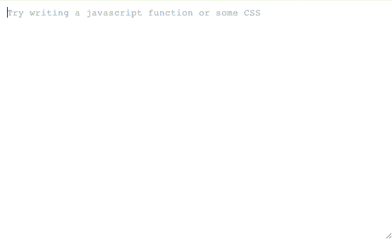
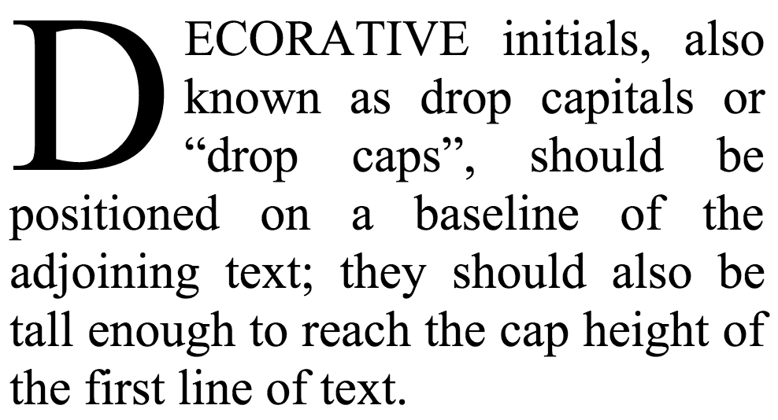

# Javascript Library

## Async.js

> [https://github.com/caolan/async](https://github.com/caolan/async)

	LICENSE: MIT

**Async** is a utility module which provides straight-forward, powerful functions for working with asynchronous JavaScript. Although originally designed for use with Node.js, it can also be used directly in the browser. Also supports component.

Async provides around 20 functions that include the usual 'functional' suspects (map, reduce, filter, each…) as well as some common patterns for asynchronous control flow (parallel, series, waterfall…). All these functions assume you follow the Node.js convention of providing a single callback as the last argument of your async function.

#### Examples

```javascript
async.map(['file1','file2','file3'], fs.stat, function(err, results){
    // results is now an array of stats for each file
});

async.filter(['file1','file2','file3'], fs.exists, function(results){
    // results now equals an array of the existing files
});

async.parallel([
    function(){ ... },
    function(){ ... }
], callback);

async.series([
    function(){ ... },
    function(){ ... }
]);
```

## Behave.js

> [http://jakiestfu.github.io/Behave.js/](http://jakiestfu.github.io/Behave.js/)

	LICENSE: MIT
	BROWSER: Partial IE6, IE7+, Firefox 8+, Safari 4+, Chrome X+, Opera 12

**Behave.js** is a lightweight library for adding IDE style behaviors to plain text areas, making it much more enjoyable to write code in.



- Supports Partial IE6, IE7+, Firefox 8+, Safari 4+, Chrome X+, Opera 12
- No Dependencies
- Custom Code/Behavior Fencing
- Hard and Soft Tabs
- Auto Open/Close Parenthesis, Brackets, Braces, Double and Single Quotes
- Auto delete a paired character
- Overwrite a paired character
- Multi-line Indentation/Unindentation
- Automatic Indentation

## countUp.js


> [http://inorganik.github.io/countUp.js/](http://inorganik.github.io/countUp.js/)

	LICENSE: MIT

**countUp.js** is a dependency-free, lightweight JavaScript "class" that can be used to quickly create animations that display numerical data in a more interesting way.

#### Examples

```javascript
var options = {
  useEasing : true, 
  useGrouping : true, 
  separator : ',', 
  decimal : '.' 
}
var demo = new countUp("myTargetElement", 24.02, 94.62, 2, 2.5, options);
demo.start();
```
## Crossfilter

> [http://square.github.io/crossfilter/](http://square.github.io/crossfilter/)

	LICENSE: Apache v2.0

**Crossfilter** is a JavaScript library for exploring large multivariate datasets in the browser. Crossfilter supports extremely fast (<30ms) interaction with coordinated views, even with datasets containing a million or more records; we built it to power analytics for Square Register, allowing merchants to slice and dice their payment history fluidly.

Since most interactions only involve a single dimension, and then only small adjustments are made to the filter values, incremental filtering and reducing is significantly faster than starting from scratch. Crossfilter uses sorted indexes (and a few bit-twiddling hacks) to make this possible, dramatically increasing the perfor­mance of live histograms and top-K lists. Crossfilter is available under the Apache License.

## dropcap.js

> [http://webplatform.adobe.com/dropcap.js/](http://webplatform.adobe.com/dropcap.js/)

	LICENSE: Apache v2.0
	BROWSER: IE10+, Firefox, Chrome, Safari


**dropcap.js** makes beautiful drop caps easy for the web.

#### Demo



## echo

> [http://toddmotto.com/labs/echo/](http://toddmotto.com/labs/echo/)

	LICENSE: MIT

**Echo** is a standalone JavaScript lazy-loading image micro-library. Echo is fast, 2KB, and uses HTML5 data-* attributes for simple. Check out a demo. Echo works in IE8+.


## FileAPI

> [http://mailru.github.io/FileAPI/](http://mailru.github.io/FileAPI/)

A set of javascript tools for working with files.

## FlowType.JS

> [http://simplefocus.com/flowtype/](http://simplefocus.com/flowtype/)

	LICENSE: MIT
	
#### What does FlowType.JS do?

Ideally, the most legible typography contains between 45 and 75 characters per line. This is difficult to accomplish for all screen widths with only CSS media-queries. FlowType.JS eases this difficulty by changing the font-size and subsequently the line-height based on a specific element's width. This allows for a perfect character count per line at any screen width.

Additional options, reviewed below, allow you to configure FlowType.JS to fit your needs. These options include element size thresholds, font-size thresholds and ratios. The element size thresholds will stop FlowType.JS from performing its magic once the element reaches beyond specific pixel dimensions. The font-size thresholds will stop FlowType.JS from resizing the text beyond certain font-sizes. Lastly, you have full control over the base font-size, so that you can set your typography perfectly.

**FlowType.JS** is extremely easy to use. Visit the getting started section, follow the four easy steps and you will be on well on your way to performing magic.

## Headroom.js

> [http://wicky.nillia.ms/headroom.js/](http://wicky.nillia.ms/headroom.js/)

	LICENSE: MIT

**Headroom.js** is a lightweight, high-performance JS widget (with no dependencies!) that allows you to react to the user's scroll. The header on this site is a living example, it slides out of view when scrolling down and slides back in when scrolling up. 

#### Why use it?

Fixed headers are a popular approach for keeping the primary navigation in close proximity to the user. This can reduce the effort required for a user to quickly navigate a site, but they are not without problems…

Large screens are usually landscape-oriented, meaning less vertical than horizontal space. A fixed header can therefore occupy a significant portion of the content area. Small screens are typically used in a portrait orientation. Whilst this results in more vertical space, because of the overall height of the screen a meaningfully-sized header can still be quite imposing.

Headroom.js allows you to bring elements into view when appropriate, and give focus to your content the rest of the time.

## impress.js


> [https://github.com/bartaz/impress.js](https://github.com/bartaz/impress.js)

	LICENSE: MIT and GPL (version 2 or later)

**impress.js** a presentation framework based on the power of CSS3 transforms and transitions in modern browsers and inspired by the idea behind prezi.com.

## interact.js

> [http://interactjs.io/](http://interactjs.io/)
	
	LICENSE: MIT

Javascript drag and drop, resizing and gestures for modern desktop and mobile browsers.

#### Awesomeness includes:

- **inertia**
- **snapping** to a grid, custom anchors or paths.
- cross browser and device, supporting the **desktop and mobile** versions of Chrome, Firefox and Opera as well as **Internet Explorer 8+**
- interaction with **SVG** elements
- being **lightweight and standalone** (not yet another jQuery plugin)
- **not modifying anything** it doesn't own (except to support IE8 and to change the cursor (but you can disable that))

## Intro.js

> [http://usablica.github.io/intro.js/](http://usablica.github.io/intro.js/)

Better introductions for websites and features with a step-by-step guide for your projects.

## is.js

> [http://arasatasaygin.github.io/is.js/](http://arasatasaygin.github.io/is.js/)

	LICENSE: MIT

Micro check library.

## keymaster

> [https://github.com/madrobby/keymaster](https://github.com/madrobby/keymaster)

	LICENSE: MIT

A simple micro-library for defining and dispatching keyboard shortcuts. It has no dependencies.

#### Supported keys

**Keymaster** understands the following modifiers: `⇧`, `shift`, `option`, `⌥`, `alt`, `ctrl`, `control`, `command`, and `⌘`.

The following special keys can be used for shortcuts: `backspace`, `tab`, `clear`, `enter`, `return`, `esc`, `escape`, `space`, `up`, `down`, `left`, `right`, `home`, `end`, `pageup`, `pagedown`, `del`, `delete` and `f1` through `f19`.

## lazy-load-xt

> [https://github.com/ressio/lazy-load-xt](https://github.com/ressio/lazy-load-xt)

	LICENSE: MIT

**Lazy load XT** is a jQuery plugin for images, videos and other media.

## localForage

> [http://mozilla.github.io/localForage/#localforage](http://mozilla.github.io/localForage/#localforage)

**localForage** is a JavaScript library that improves the offline experience of your web app by using an asynchronous data store with a simple, localStorage-like API. It allows developers to store many types of data instead of just strings.

localForage includes a localStorage-backed fallback store for browsers with no IndexedDB or WebSQL support. Asynchronous storage is available in the current versions of all major browsers: Chrome, Firefox, IE, and Safari (including Safari Mobile).

localForage supports both a callback-based and Promises-based API, so you can use whichever you prefer. At the current time, these docs use the callback API.

#### Examples

```javascript
// In localStorage, we would do:
localStorage.setItem('key', JSON.stringify('value'));
doSomethingElse();

// With localForage, we use callbacks:
localforage.setItem('key', 'value', doSomethingElse);

// Or we can use Promises:
localforage.setItem('key', 'value').then(doSomethingElse);
```

## lodash

> [https://lodash.com/](https://lodash.com/)

A JavaScript utility library delivering consistency, modularity, performance, & extras.

## math.js

> [http://mathjs.org/](http://mathjs.org/)

	LICENSE: Apache v2.0


**Math.js** is an extensive math library for JavaScript and Node.js. It features a flexible expression parser and offers an integrated solution to work with numbers, big numbers, complex numbers, units, and matrices. Powerful and easy to use.

#### Features

- Supports numbers, big numbers, complex numbers, units, strings, arrays, and matrices.
- Is compatible with JavaScript’s built-in Math library.
- Contains a flexible expression parser.
- Supports chained operations.
- Comes with a large set of built-in functions and constants.
- Has no dependencies. Runs on any JavaScript engine.
- Is easily extensible.
- Open source.

#### Examples

```javascript
// functions and constants
math.round(math.e, 3);            // 2.718
math.atan2(3, -3) / math.pi;      // 0.75
math.log(10000, 10);              // 4
math.sqrt(-4);                    // 2i
math.pow([[-1, 2], [3, 1]], 2);
     // [[7, 0], [0, 7]]

// expressions
math.eval('1.2 * (2 + 4.5)');     // 7.8
math.eval('5.08 cm to inch');     // 2 inch
math.eval('sin(45 deg) ^ 2');     // 0.5
math.eval('9 / 3 + 2i');          // 3 + 2i
math.eval('det([-1, 2; 3, 1])');  // -7

// chained operations
math.select(3)
    .add(4)
    .multiply(2)
    .done(); // 14
```

## Mousetrap

> [http://craig.is/killing/mice](http://craig.is/killing/mice)

	LICENSE: Apache v2.0
	BROWSER: Chrome, Firefox, Safari, IE 6+

**Mousetrap** is a simple library for handling keyboard shortcuts in Javascript.

It has support for keypress, keydown, and keyup events on specific keys, keyboard combinations, or key sequences.

#### Why Mousetrap?

There are a number of other similar libraries out there so what makes this one different?

- There are no external dependencies, no framework is required
- You are not limited to keydown events (You can specify keypress, keydown, or keyup or let Mousetrap choose for you).
- You can bind key events directly to special keys such as ? or * without having to specify shift+/ or shift+8 which are not consistent across all keyboards
- It works with international keyboard layouts
- You can bind Gmail like key sequences in addition to regular keys and key combinations
- You can programatically trigger key events with the trigger() method
- It works with the numeric keypad on your keyboard
- The code is well documented/commented

#### Examples

```javascript
// single keys
Mousetrap.bind('4', function() { highlight(2); });
Mousetrap.bind('x', function() { highlight(3); }, 'keyup');

// combinations
Mousetrap.bind('command+shift+k', function(e) {
    highlight([6, 7, 8, 9]);
    return false;
});

Mousetrap.bind(['command+k', 'ctrl+k'], function(e) {
    highlight([11, 12, 13, 14]);
    return false;
});

// gmail style sequences
Mousetrap.bind('g i', function() { highlight(17); });
Mousetrap.bind('* a', function() { highlight(18); });

// konami code!
Mousetrap.bind('up up down down left right left right b a enter', function() {
    highlight([21, 22, 23]);
});
```

## PapaParse

> [http://papaparse.com/](http://papaparse.com/)
	
	LICENSE: MIT

**Papa Parse** (formerly the jQuery Parse Plugin) is a robust and powerful CSV (character-separated values) parser with these features:

- Easy to use
- Parse CSV files directly (local or over the network)
- Stream large files (even via HTTP)
- Reverse parsing (converts JSON to CSV)
- Auto-detect the delimiter
- Worker threads to keep your web page reactive
- Header row support
- Can convert numbers and booleans to their types
- Graceful and robust error handling
- Minor jQuery integration to get files from  `<input type="file">`  elements

All are optional (except for being easy to use).

## Recline.js

> [http://okfnlabs.org/recline/](http://okfnlabs.org/recline/)

	LICENSE: 


A simple but powerful library for building data applications in pure Javascript and HTML.
**Recline** re-uses best-of-breed presentation libraries like SlickGrid, Leaflet, Flot and D3 to create data 'Views' and allows you to connect them with your data in seconds.

#### Examples

```javascript
// Load some data
var dataset = recline.Model.Dataset({
  records: [
    { value: 1, date: '2012-08-07' },
    { value: 5, b: '2013-09-07' }
  ]
  // Load CSV data instead
  // (And Recline has support for many more data source types)
  // url: 'my-local-csv-file.csv',
  // backend: 'csv'
});

// get an element from your HTML for the viewer
var $el = $('#data-viewer');

var allInOneDataViewer = new recline.View.MultiView({
  model: dataset,
  el: $el
});
// Your new Data Viewer will be live!
```

#### Demos


## javascript-state-machine

> [https://github.com/jakesgordon/javascript-state-machine](https://github.com/jakesgordon/javascript-state-machine)

A finite state machine javascript micro framework.

## string.js

> [http://stringjs.com/](http://stringjs.com/)

	LICENSE: MIT

**string.js**, or simply S is a lightweight (< 5 kb minified and gzipped) JavaScript library for the browser or for Node.js that provides extra String methods. Originally, it modified the String prototype. But I quickly learned that in JavaScript, this is considered poor practice.

## SideComments.js

> [http://aroc.github.io/side-comments-demo](http://aroc.github.io/side-comments-demo/#header)

	LICENSE: MIT
	
**SideComments.js** is a UI component to give you Medium.com style comment management on the front-end. It allows users to comment directly on sections of content rather than the boring comment stream on the bottom of the page that we're so used to.

**Note:** This component only handles the display / user interface of how your comments are presented. It does not provide any utilities to help manage storing or retreiving your comment data from your server, how you do that is entirely up to you. Check out the integrations section for resources related to back-end integration.

## store.js

> [https://github.com/marcuswestin/store.js](https://github.com/marcuswestin/store.js)

	LICENSE: MIT

localStorage wrapper for all browsers without using cookies or flash. Uses localStorage, globalStorage, and userData behavior under the hood [http://twitter.com/marcuswestin](http://twitter.com/marcuswestin)

#### Unsupported browsers

- Firefox 1.0: no means (beside cookies and flash)
- Safari 2: no means (beside cookies and flash)
- Safari 3: no synchronous api (has asynch sqlite api, but store.js is synch)
- Opera 9: don't know if there is synchronous api for storing data locally
- Firefox 1.5: don't know if there is synchronous api for storing data locally
- Microsoft IIS & IE7: With meta tag & "charset=iso-8859-1", things stop working. See issue #47.

## task.js

> [http://taskjs.org/](http://taskjs.org/)	


**task.js** is an experimental library for ES6 that makes sequential, blocking I/O simple and beautiful, using the power of JavaScript’s new yield operator.
Tasks are interleaved like threads, but they are cooperative rather than pre-emptive: they block on promises with yield. Here’s an example using jQuery:

```javascript
spawn(function*() {
    var data = yield $.ajax(url);
    $('#result').html(data);
    var status = $('#status').html('Download complete.');
    yield status.fadeIn().promise();
    yield sleep(2000);
    status.fadeOut();
});
```

task.js works with any framework or library that uses the Promises/A spec.

## TheaterJS

> [http://codepen.io/Zhouzi/full/JoRazP/](http://codepen.io/Zhouzi/full/JoRazP/)

	LICENSE: MIT

**TheaterJS** is a typing effect mimicking human behavior.


## TogetherJS

> [https://togetherjs.com/](https://togetherjs.com/)

	LICENSE: MPL v2.0

**TogetherJS** is a service for your website that makes it surprisingly easy to collaborate in real-time.

Using TogetherJS two people can interact on the same page, seeing each other's cursors, edits, and browsing a site together. The TogetherJS service is included by the web site owner, and a web site can customize and configure aspects of TogetherJS's behavior on the site.

## unveil

> [https://github.com/luis-almeida/unveil](https://github.com/luis-almeida/unveil)

	LICENSE: MIT

A very lightweight plugin to lazy load images for jQuery or Zepto.js.

## vagueTime.js

> [https://github.com/philbooth/vagueTime.js](https://github.com/philbooth/vagueTime.js)

	LICENSE: MIT

A tiny JavaScript library that formats precise time differences as a vague/fuzzy time. Supports 9 different languages.