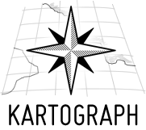

Map
===

Kartograph
----------

> [http://kartograph.org/](http://kartograph.org/)

	LICENSE: AGPL


**Kartograph** is a simple and lightweight framework for building interactive map applications without Google Maps or any other mapping service. It was created with the needs of designers and data journalists in mind.
Actually, Kartograph is two libraries. One generates beautiful & compact SVG maps; the other helps you to create interactive maps that run across all major browsers.

#### Kartograph.js
A JavaScript library for creating interactive maps based on Kartograph.py SVG maps.

- Easy to use: create an interactve map within minutes.
- Runs 100% stand-alone. No server needed.
- Gracefully degrades to Internet Explorer 7+
- Built on top of Raphaël and jQuery
- Licensed under LGPL

Leaflet
-------
> [http://leafletjs.com/](http://leafletjs.com/)
	
	LICENSE: MIT


**Leaflet** is a modern open-source JavaScript library for mobile-friendly interactive maps. It is developed by Vladimir Agafonkin with a team of dedicated contributors. Weighing just about 33 KB of JS, it has all the features most developers ever need for online maps.

Leaflet is designed with simplicity, performance and usability in mind. It works efficiently across all major desktop and mobile platforms out of the box, taking advantage of HTML5 and CSS3 on modern browsers while still being accessible on older ones. It can be extended with a huge amount of plugins, has a beautiful, easy to use and well-documented API and a simple, readable source code that is a joy to contribute to.

#### Examples:

```javascript
// create a map in the "map" div, set the view to a given place and zoom
var map = L.map('map').setView([51.505, -0.09], 13);

// add an OpenStreetMap tile layer
L.tileLayer('http://{s}.tile.osm.org/{z}/{x}/{y}.png', {
    attribution: '&copy; <a href="http://osm.org/copyright">OpenStreetMap</a> contributors'
}).addTo(map);

// add a marker in the given location, attach some popup content to it and open the popup
L.marker([51.5, -0.09]).addTo(map)
    .bindPopup('A pretty CSS3 popup. <br> Easily customizable.')
    .openPopup();
```


OpenLayers
----------

> [http://openlayers.org/](http://openlayers.org/)

	LICENSE: BSD
	TAG: 


**OpenLayers** makes it easy to put a dynamic map in any web page. It can display map tiles and markers loaded from any source. OpenLayers has been developed to further the use of geographic information of all kinds. OpenLayers is completely free, Open Source JavaScript, released under the 2-clause BSD License (also known as the FreeBSD).

Polymaps
--------

> [http://polymaps.org/](http://polymaps.org/)

	LICENSE: 
	TAG: SVG

**Polymaps** provides speedy display of multi-zoom datasets over maps, and supports a variety of visual presentations for tiled vector data, in addition to the usual cartography from OpenStreetMap, CloudMade, Bing, and other providers of image-based web maps.

Because Polymaps can load data at a full range of scales, it’s ideal for showing information from country level on down to states, cities, neighborhoods, and individual streets. Because Polymaps uses SVG (Scalable Vector Graphics) to display information, you can use familiar, comfortable CSS rules to define the design of your data. And because Polymaps uses the well known spherical mercator tile format for its imagery and its data, publishing information is a snap.

#### Demos

