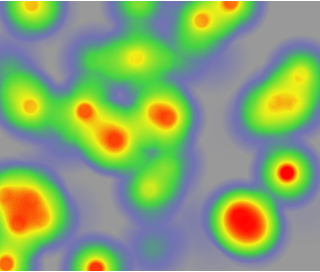
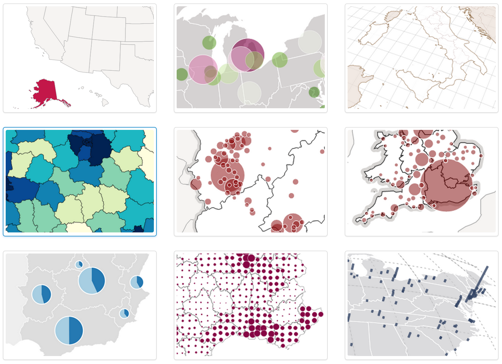

# Map

## heatmap.js

> [http://www.patrick-wied.at/static/heatmapjs/](http://www.patrick-wied.at/static/heatmapjs/)

	LICENSE: 

**heatmap.js** v2.0 is the most advanced heatmap visualization library on the web.

It has a light footprint (~3kB gzip) and with the new 2.0 release heatmap.js just got

- faster, with a new rendering module
- stronger, to handle even more datapoints (40k+)
- easier to use so you can get up to speed quickly
- easier to extend for custom functionality

than ever before. Also:
All the struggles with unpredictably bad open source support have an end
The new support license will secure you the premium support you deserve

#### Demo



## JuxtaposeJS

> [http://juxtapose.knightlab.com/](http://juxtapose.knightlab.com/)

	LICENSE: MPL v2.0
	
**JuxtaposeJS** helps storytellers compare two pieces of similar media, including photos, and gifs. It’s ideal for highlighting then/now stories that explain slow changes over time (grown of a city skyline, regrowth of a forest, etc.) or before/after stories that show the impact of single dramatic events (natural disasters, protests, wars, etc.).

It is free, easy to use, and works on all devices. All you need to get started are links to the images you'd like to compare.


## Kartograph

> [http://kartograph.org/](http://kartograph.org/)

	LICENSE: AGPL


**Kartograph** is a simple and lightweight framework for building interactive map applications without Google Maps or any other mapping service. It was created with the needs of designers and data journalists in mind.
Actually, Kartograph is two libraries. One generates beautiful & compact SVG maps; the other helps you to create interactive maps that run across all major browsers.

#### Demo



## Leaflet

> [http://leafletjs.com/](http://leafletjs.com/)
	
	LICENSE: MIT


**Leaflet** is a modern open-source JavaScript library for mobile-friendly interactive maps. It is developed by Vladimir Agafonkin with a team of dedicated contributors. Weighing just about 33 KB of JS, it has all the features most developers ever need for online maps.

Leaflet is designed with simplicity, performance and usability in mind. It works efficiently across all major desktop and mobile platforms out of the box, taking advantage of HTML5 and CSS3 on modern browsers while still being accessible on older ones. It can be extended with a huge amount of plugins, has a beautiful, easy to use and well-documented API and a simple, readable source code that is a joy to contribute to.

#### Examples:

```javascript
// create a map in the "map" div, set the view to a given place and zoom
var map = L.map('map').setView([51.505, -0.09], 13);

// add an OpenStreetMap tile layer
L.tileLayer('http://{s}.tile.osm.org/{z}/{x}/{y}.png', {
    attribution: '&copy; <a href="http://osm.org/copyright">OpenStreetMap</a> contributors'
}).addTo(map);

// add a marker in the given location, attach some popup content to it and open the popup
L.marker([51.5, -0.09]).addTo(map)
    .bindPopup('A pretty CSS3 popup. <br> Easily customizable.')
    .openPopup();
```


## OpenLayers

> [http://openlayers.org/](http://openlayers.org/)

	LICENSE: BSD
	TAG: 


**OpenLayers** makes it easy to put a dynamic map in any web page. It can display map tiles and markers loaded from any source. OpenLayers has been developed to further the use of geographic information of all kinds. OpenLayers is completely free, Open Source JavaScript, released under the 2-clause BSD License (also known as the FreeBSD).

## Polymaps

> [http://polymaps.org/](http://polymaps.org/)

	LICENSE: 
	TAG: SVG

**Polymaps** provides speedy display of multi-zoom datasets over maps, and supports a variety of visual presentations for tiled vector data, in addition to the usual cartography from OpenStreetMap, CloudMade, Bing, and other providers of image-based web maps.

Because Polymaps can load data at a full range of scales, it’s ideal for showing information from country level on down to states, cities, neighborhoods, and individual streets. Because Polymaps uses SVG (Scalable Vector Graphics) to display information, you can use familiar, comfortable CSS rules to define the design of your data. And because Polymaps uses the well known spherical mercator tile format for its imagery and its data, publishing information is a snap.

#### Demos


## StoryMapJS

> [http://storymap.knightlab.com/](http://storymap.knightlab.com/)

	LICENSE: MIT

**StoryMapJS** is a free tool to help you tell stories on the web that highlight the locations of a series of events. It is a new tool, yet stable in our development environment, and it has a friendly authoring tool. It has two significant, related features:

**Gigapixel**

StoryMapJS can tell stories with large photographs, works of art, historic maps, and other image files. Because it works best with pixel-dense files, we call these "gigapixel" StoryMaps. Learn more.

**SnapMap**

SnapMap is a tool to help you quickly create a StoryMap. It places your 20 most recent geo-tagged Instagrams on a map that can be shared instantly. You can also edit it in StoryMap's authoring tool, adding media from other sources.

We welcome feedback and bug reports: you can use our support forum to post questions, or email support@knightlab.zendesk.com.

StoryMapJS is open source and offered under the MIT license.

