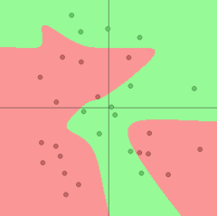
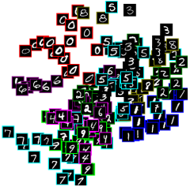
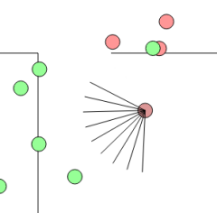
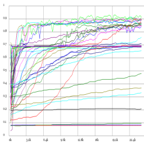

Machine Learning
================

ConvNetJS
---------

> [http://cs.stanford.edu/people/karpathy/convnetjs/](http://cs.stanford.edu/people/karpathy/convnetjs/)

	LICENSE: MIT

**ConvNetJS** is a Javascript library for training Deep Learning models (mainly Neural Networks) entirely in your browser. Open a tab and you're training. No software requirements, no compilers, no installations, no GPUs, no sweat.

#### Description

The library allows you to formulate and solve Neural Networks. Current support includes:

- **Classification** of data into fixed number of categories
- **Regression** into real-valued outputs
- Support for formulating **Convolutional Neural Networks**, which are archtiectures specifically designed for doing classification/regression when your data consists of images.
- **Reinforcement Learning** module based on Deep Q Learning.

#### Demos











brain
-----

> [https://github.com/harthur/brain](https://github.com/harthur/brain)

	LICENSE: MIT

**brain** is a JavaScript neural network library. Here's an example of using it to approximate the XOR function:

```javascript
var net = new brain.NeuralNetwork();

net.train([{input: [0, 0], output: [0]},
           {input: [0, 1], output: [1]},
           {input: [1, 0], output: [1]},
           {input: [1, 1], output: [0]}]);

var output = net.run([1, 0]);  // [0.987]
```