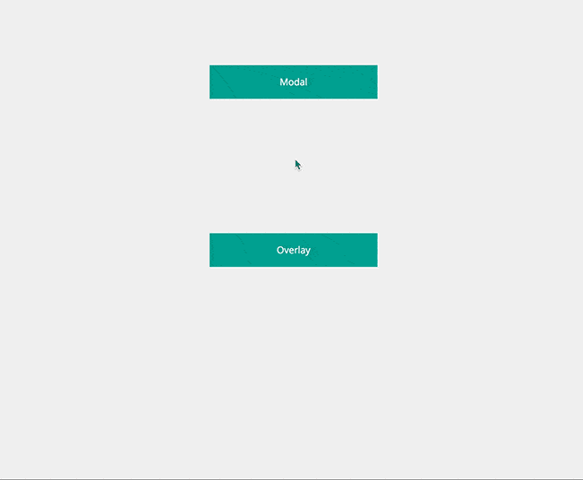

# Angular.js

## Angular-filter

> [https://github.com/a8m/angular-filter](https://github.com/a8m/angular-filter)

	LICENSE: MIT

Bunch of useful filters for AngularJS (with no external dependencies!) 

## Material Design

> [https://material.angularjs.org/](https://material.angularjs.org/)

	LICENSE: MIT

**Material Design** is a specification for a unified system of visual, motion, and interaction design that adapts across different devices.

Our goal is to deliver a lean, lightweight set of AngularJS-native UI elements that implement the material design system for use in Angular SPAs.

This project is still in early preview. It is a complementary effort to the Polymer project's paper elements collection.

## ment.io

> [https://github.com/jeff-collins/ment.io](https://github.com/jeff-collins/ment.io)

	LICENSE: MIT

The **mentio** directive is applied to any element that accepts selectable text input and exposes an ngModel. The mentio directive watches the ngModel of the element for changes. If the user enters a sequence of non-wihtespace characters starting with a trigger character, a typeahead menu appears.

## ngMorph

> [https://github.com/jimobrien/ngMorph](https://github.com/jimobrien/ngMorph)

	LICENSE: 

This module is an attempt at packaging transitions/animations into directives that enable the reuse of elements by morphing them into other elements. The idea was inspired by Google's Topeka project and a great concept I saw on Codrops. Simply create an originating element and apply the ng-morph-<type> directive to make it morphable. Check out the demo page to see it in action!

#### Demo

