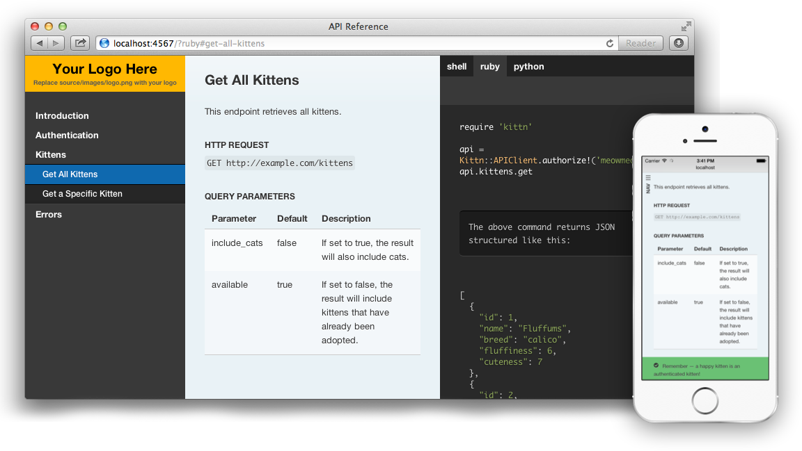

# Standalone Pages

## slate

> [https://github.com/tripit/slate](https://github.com/tripit/slate)

	LICENSE: Apache v2.0

Beautiful static documentation for your API. **Slate** helps you create beautiful API documentation. Think of it as an intelligent, responsive documentation template for your API.

#### PREREQUISIITES

* Linux or OS X — Windows may work, but is unsupported.
* Ruby, version 1.9.3 or newer
* Bundler — If Ruby is already installed, but the bundle command doesn't work, just run gem install bundler in a terminal.

#### Features

* **Clean, intuitive design** — with Slate, the description of your API is on the left side of your documentation, and all the code examples are on the right side. Inspired by Stripe's and Paypal's API docs. Slate is responsive, so it looks great on tablets, phones, and even print.
* **Everything on a single page** — gone are the days where your users had to search through a million pages to find what they wanted. Slate puts the entire documentation on a single page. We haven't sacrificed linkability, though. As you scroll, your browser's hash will update to the nearest header, so linking to a particular point in the documentation is still natural and easy.
* **Slate is just Markdown** — when you write docs with Slate, you're just writing Markdown, which makes it simple to edit and understand. Everything is written in Markdown — even the code samples are just Markdown code blocks!
* **Write code samples in multiple languages** — if your API has bindings in multiple programming languages, you easily put in tabs to switch between them. In your document, you'll distinguish different languages by specifying the language name at the top of each code block, just like with Github Flavored Markdown!
* **Out-of-the-box syntax highlighting** for almost 60 languages, no configuration required.
* **Automatic, smoothly scrolling table of contents** on the far left of the page. As you scroll, it displays your current position in the document. It's fast, too. We're using Slate at TripIt to build documentation for our new API, where our table of contents has over 180 entries. We've made sure that the performance remains excellent, even for larger documents.
* **Let your users update your documentation for you** — by default, your Slate-generated documentation is hosted in a public Github repository. Not only does this mean you get free hosting for your docs with Github Pages, but it also makes it's simple for other developers to make pull requests to your docs if they find typos or other problems. Of course, if you don't want to, you're welcome to not use Github and host your docs elsewhere!