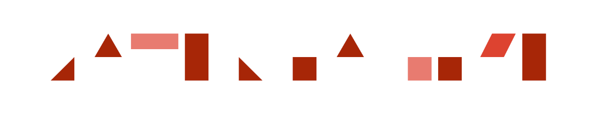

# UI

## Materialize

> [http://materializecss.com/](http://materializecss.com/)

	LICENSE: MIT
	BROWSER: Chrome 35+, Firefox 31+, Safari 7+, IE 10+

**Materialize**, a CSS Framework based on material design.

## Semantic UI

> [http://semantic-ui.com/](http://semantic-ui.com/)

	LICENSE: MIT
	BROWSER: Safari 6, Last 2 Versions FF, Chrome, IE 10+, Android 4, Blackberry 10

**Semantic** is a UI framework designed for theming.

Key Features

* 50+ UI elements
* 3000 + CSS variables
* 3 Levels of variable inheritance (similar to SublimeText)
* Built with EM values for responsive design
* Flexbox friendly

## uikit

> [http://getuikit.com/index.html](http://getuikit.com/index.html)

	LICENSE: MIT
	BROWSER: Chrome, Firefox, IE 9+, Safari 7.1+, Opera

A lightweight and modular front-end framework
for developing fast and powerful web interfaces.