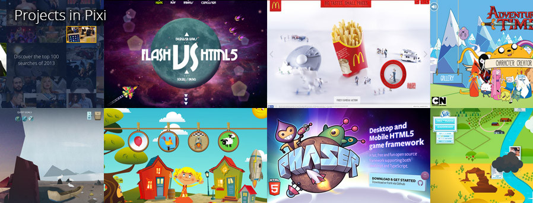

# Visualization

## Babylon.js

> [http://www.babylonjs.com/](http://www.babylonjs.com/)

    LICENSE: Apache v2.0
    
**Babylon.js** is a 3D engine based on webgl and javascript. 

#### Features

* Complete scene graph with lights, cameras, materials and meshes
* Collisions engine
* Physics engine (thanks to oimo.js)
* Scene picking
* Antialiasing
* Animations engine
* Audio engine
* Particles Systems
* Sprites and 2D layers
* Optimizations engines:
    * Frustum clipping
    * Sub-meshes clipping
    * Hardware scaling
    * Selection octrees
    * Offline mode via IndexedDB (Assets are saved locally to prevent reloading them)
    * Incremental loading
    * Binary compressed format
    * Hardware accelerated instances
    * Level of details (LOD)
    * Automatic scene optimizer
    * Debug layer to help you optimize and debug scenes
* Standard material is a per pixel material that supports:
    * Diffuse lightning and texture
    * Ambient lightning and texture
    * Specular lightning
    * Opacity texture
    * Reflection texture (Spheric, planar, cubic and projection)
    * Mirror texture
    * Emissive texture
    * Specular texture
    * Bump texture
    * Fresnel term for diffuse, opacity, emissive and reflection
    * Up to 4 lights (points, directionals, spots, hemispherics)
    * Custom materials
    * Custom shaders
    * Skybox
    * Vertex color
    * Bones (Animations and shadows are supported)
    * Procedural textures
* Special FX
    * Fog
    * Alpha blending
    * Alpha testing
    * Billboarding
    * Fullscreen mode
    * Shadow Maps and Variance Shadow Maps
    * Rendering layers
    * Post-processes (blur, refraction, black'n'white, fxaa, customs...)
    * SSAO
    * Volumetric Light Scattering
    * Lens flares
    * Multi-views
* Textures:
    * Render target textures
    * Dynamic textures (canvas)
    * Video textures
    * Compressed (DDS) textures
    * TGA textures
* Cameras (Perspective and orthographic):
    * Arc rotate camera
    * Free camera
    * Touch camera
    * Anaglyph camera
    * Virtual Joysticks camera
    * Oculus Rift camera
    * Gamepad camera
    * VR Device Oriention camera
    * WebVR camera
    * Follow camera
* Meshes:
    * Mesh cloning
    * Dynamic meshes
    * Height maps
    * Constructive solid geometries
    * Hardware instances
* Import:
	* Babylon scene file can be converted from .OBJ, .FBX
	* Exporter for Blender
	* Exporter for Cheetah3d
	* Exporter for 3ds Max
	* Assets manager

## Crafty

> [http://craftyjs.com/](http://craftyjs.com/)


**Crafty** is a JavaScript game library that can help you create games in a structured way…

Key Features:

* Entities & Components - A clean and decoupled way to organize game elements. No inheritance needed!
* Eventbinding - Event system for custom events that can be triggered whenever, whatever and bound just as easily.
* No dom manipulation or custom drawing routines required.

Other Goodies:

* Thriving community - Help is readily available in the forum.
* Community modules - A growing collection of user-generated code you can use.
* Pure JavaScript - No magic. Works in all major browsers and can be combined with your favorite js library.


## d3.js

> [http://d3js.org/](http://d3js.org/)

    LICENSE: BSD
    BROWSER: IE6+, Firefox2+, Safari3+, Opera9.5+
    TAG: SVG


**D3.js** is a JavaScript library for manipulating documents based on data. D3 helps you bring data to life using HTML, SVG and CSS. D3’s emphasis on web standards gives you the full capabilities of modern browsers without tying yourself to a proprietary framework, combining powerful visualization components and a data-driven approach to DOM manipulation.

#### Introduction

**D3** allows you to bind arbitrary data to a Document Object Model (DOM), and then apply data-driven transformations to the document. For example, you can use D3 to generate an HTML table from an array of numbers. Or, use the same data to create an interactive SVG bar chart with smooth transitions and interaction.

D3 is not a monolithic framework that seeks to provide every conceivable feature. Instead, D3 solves the crux of the problem: efficient manipulation of documents based on data. This avoids proprietary representation and affords extraordinary flexibility, exposing the full capabilities of web standards such as CSS3, HTML5 and SVG. With minimal overhead, D3 is extremely fast, supporting large datasets and dynamic behaviors for interaction and animation. D3’s functional style allows code reuse through a diverse collection of components and plugins.

#### Demos:


## InfoVis Toolkit

> [http://philogb.github.io/jit/index.html](http://philogb.github.io/jit/index.html)
    
    LICENSE: MIT
    BROWSER: IE6+, Firefox2+, Safari3+, Opera9.5+
    TAG: Canvas

The JavaScript **InfoVis Toolkit** provides tools for creating Interactive Data Visualizations for the Web.

#### Demos:


## Matter.js

> [http://brm.io/matter-js/](http://brm.io/matter-js/)

    LICENSE: MIT

**Matter.js** is a JavaScript 2D rigid body physics engine for the web.

#### Features

- Physical properties (mass, area, density etc.)
- Rigid bodies of any convex polygon
- Stable stacking and resting
- Collisions (broad-phase, mid-phase and narrow-phase)
- Restitution (elastic and inelastic collisions)
- Conservation of momentum
- Friction and resistance
- Constraints
- Gravity
- Composite bodies
- Sleeping and static bodies
- Events
- Rounded corners (chamfering)
- Views (translate, zoom)
- Collision queries (raycasting, region tests)
- Time scaling (slow-mo, speed-up)
- Canvas renderer (supports vectors and textures)
- WebGL renderer (requires pixi.js)
- MatterTools for creating, testing and debugging worlds
- World state serialisation (requires resurrect.js)
- Cross-browser (Chrome, Firefox, Safari, IE8+)
- Mobile-compatible (touch, responsive)
- An original JavaScript physics implementation (not a port)

## Phaser

> [http://phaser.io/](http://phaser.io/)

	LICENSE: MIT


**Phaser** is a fast, free and fun open source HTML5 game framework. It uses Pixi.js for WebGL and Canvas rendering across desktop and mobile web browsers. Games can be compiled to iOS and Android apps via 3rd party tools.

Along with the fantastic open source community Phaser is actively developed and maintained by Photon Storm Limited. As a result of rapid support and a developer friendly API Phaser is currently one of the most starred game frameworks on Github.

Thousands of developers worldwide use it. From indies and multi-national digital agencies to schools and Universities. Each creating their own incredible games. Grab the source and join in the fun!

#### Demo


## PhysicsJS

> [http://wellcaffeinated.net/PhysicsJS/](http://wellcaffeinated.net/PhysicsJS/)

	LICENSE: MIT

A modular, extendable, and easy-to-use physics engine for javascript.

## pxix.js

> [https://github.com/GoodBoyDigital/pixi.js](https://github.com/GoodBoyDigital/pixi.js)

	LICENSE: MIT


The aim of this project is to provide a fast lightweight 2D library that works across all devices. The **Pixi** renderer allows everyone to enjoy the power of hardware acceleration without prior knowledge of webGL. Also, it's fast.

#### Demo


## Processing.js

> [http://processingjs.org/](http://processingjs.org/)
    
    LICENSE: GPL v2
    BROWSER: Safari, Firefox, Chrome, Opera, IE
    TAG: Canvas


**Processing.js** is the sister project of the popular Processing visual programming language, designed for the web. Processing.js makes your data visualizations, digital art, interactive animations, educational graphs, video games, etc. work using web standards and without any plug-ins. You write code using the Processing language, include it in your web page, and Processing.js does the rest. It's not magic, but almost.

## Protovis

> [http://mbostock.github.io/protovis/](http://mbostock.github.io/protovis/)
        
    LICENSE: BSD
    BROWSER: Firefox 3, Chrome and Safari 4
    TAG: SVG

**Protovis** composes custom views of data with simple marks such as bars and dots. Unlike low-level graphics libraries that quickly become tedious for visualization, Protovis defines marks through dynamic properties that encode data, allowing inheritance, scales and layouts to simplify construction.

Protovis is free and open-source, provided under the BSD License. It uses JavaScript and SVG for web-native visualizations; no plugin required (though you will need a modern web browser)! Although programming experience is helpful, Protovis is mostly declarative and designed to be learned [by example](http://mbostock.github.io/protovis/ex/ "by example").

#### Getting Started
How does Protovis work? Consider this bar chart, which visually encodes an array of numbers with height:
```javascript
var vis = new pv.Panel()
    .width(150)
    .height(150);

vis.add(pv.Bar)
    .data([1, 1.2, 1.7, 1.5, .7, .3])
    .width(20)
    .height(function(d) d * 80)
    .bottom(0)
    .left(function() this.index * 25);

vis.render();
```


This blue bar is rendered once per number, mapping the data to height using a little function (d * 80). Thus, a mark represents a set of graphical elements that share data and visual encodings. Although marks are simple by themselves, you can combine them in interesting ways to make rich, interactive visualizations.

To simplify construction, Protovis supports panels and inheritance. A panel is a container for replicating marks. Inheritance lets you derive new marks from existing ones, sharing some or all of the properties. For example, here we derive labels for a rule and bar:
```javascript
var vis = new pv.Panel()
    .width(150)
    .height(150);

vis.add(pv.Rule)
    .data(pv.range(0, 2, .5))
    .bottom(function(d) d * 80 + .5)
  .add(pv.Label);

vis.add(pv.Bar)
    .data([1, 1.2, 1.7, 1.5, .7])
    .width(20)
    .height(function(d) d * 80)
    .bottom(0)
    .left(function() this.index * 25 + 25)
  .anchor("bottom").add(pv.Label);

vis.render();
```


The rule’s label inherits the data and bottom property, causing it to appear on the rule and render the value (datum) as text. The bar’s label uses the bottom anchor to tweak positioning, so that the label is centered at the bottom of the bar.

## Raphaël

> [http://raphaeljs.com/](http://raphaeljs.com/)
        
    LICENSE: MIT
    BROWSER: Firefox 3.0+, Safari 3.0+, Chrome 5.0+, Opera 9.5+ and Internet Explorer 6.0+
    TAG: SVG, VML


**Raphaël** is a small JavaScript library that should simplify your work with vector graphics on the web. If you want to create your own specific chart or image crop and rotate widget, for example, you can achieve it simply and easily with this library.

Raphaël ['ræfeɪəl] uses the SVG W3C Recommendation and VML as a base for creating graphics. This means every graphical object you create is also a DOM object, so you can attach JavaScript event handlers or modify them later. Raphaël’s goal is to provide an adapter that will make drawing vector art compatible cross-browser and easy.

#### Examples:
```javascript
// Creates canvas 320 × 200 at 10, 50
var paper = Raphael(10, 50, 320, 200);

// Creates circle at x = 50, y = 40, with radius 10
var circle = paper.circle(50, 40, 10);
// Sets the fill attribute of the circle to red (#f00)
circle.attr("fill", "#f00");

// Sets the stroke attribute of the circle to white
circle.attr("stroke", "#fff");
```
#### Demos:


## snap.svg

> [http://snapsvg.io/](http://snapsvg.io/)

    LICENSE: Apache v2.0


**Snap.svg** is a brand new JavaScript library for working with SVG. Snap provides web developers with a clean, streamlined, intuitive, and powerful API for animating and manipulating both existing SVG content, and SVG content generated with Snap.

Currently, the most popular library for working with SVG is Raphaël. One of the primary reasons Raphaël became the de facto standard is that it supports browsers all the way back to IE 6. However, supporting so many browsers means only being able to implement a common subset of SVG features. Snap was written entirely from scratch by the author of Raphaël (Dmitry Baranovskiy), and is designed specifically for modern browsers (IE9 and up, Safari, Chrome, Firefox, and Opera). Targeting more modern browsers means that Snap can support features like masking, clipping, patterns, full gradients, groups, and more.

Another unique feature of Snap is its ability to work with existing SVG. That means your SVG content does not have to be generated with Snap for you to be able to use Snap to work with it (think “jQuery or Zepto for SVG”). That means you create SVG content in tools like Illustrator, Inkscape, or Sketch then animate or otherwise manipulate it using Snap. You can even work with strings of SVG (for example, SVG files loaded via Ajax) without having to actually render it first which means you can do things like query specific shapes out of an SVG file, essentially turning it into a resource container or sprite sheet.

Finally, Snap supports animation. By providing a simple and intuitive JavaScript API for animation, Snap can help make your SVG content more interactive and engaging.

Snap is 100% free and 100% open-source (released under an Apache 2 license).

## three.js

> [http://threejs.org/](http://threejs.org/)

    LICENSE: MIT
    TAG: CANVAS, SVG, CSS3D, WEBGL

JavaScript 3D library. The aim of the project is to create a lightweight 3D library with a very low level of complexity — in other words, for dummies. The library provides canvas, svg, CSS3D and WebGL renderers.

## vis.js

> [http://visjs.org/](http://visjs.org/)

    LICENSE: Apache v2.0


**Vis.js** is a dynamic, browser based visualization library. The library is designed to be easy to use, to handle large amounts of dynamic data, and to enable manipulation of and interaction with the data. The library consists of the components DataSet, Timeline, Network, Graph2d, and Graph3d.
The vis.js library is developed by Almende B.V, as part of CHAP. Vis.js runs fine on Chrome, Firefox, Opera, Safari, IE9+, and most mobile browsers (with full touch support).

#### Examples

```javascript
// DOM element where the Timeline will be attached
var container = document.getElementById('mytimeline');

// Create a DataSet with data (enables two way data binding)
var data = new vis.DataSet([
  {id: 1, content: 'item 1', start: '2013-04-20'},
  {id: 2, content: 'item 2', start: '2013-04-14'},
  {id: 3, content: 'item 3', start: '2013-04-18'},
  {id: 4, content: 'item 4', start: '2013-04-16', end: '2013-04-19'},
  {id: 5, content: 'item 5', start: '2013-04-25'},
  {id: 6, content: 'item 6', start: '2013-04-27'}
]);

// Configuration for the Timeline
var options = {};

// Create a Timeline
var timeline = new vis.Timeline(container, data, options);
```