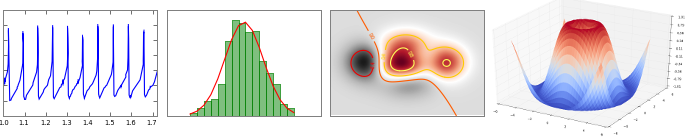

# Chart

## matplotlib

> [http://matplotlib.org/](http://matplotlib.org/)

	LICENSE: PSF

**matplotlib** is a python 2D plotting library which produces publication quality figures in a variety of hardcopy formats and interactive environments across platforms. matplotlib can be used in python scripts, the python and ipython shell (ala MATLAB®* or Mathematica®†), web application servers, and six graphical user interface toolkits. matplotlib tries to make easy things easy and hard things possible. You can generate plots, histograms, power spectra, bar charts, errorcharts, scatterplots, etc, with just a few lines of code. 

#### Demos

